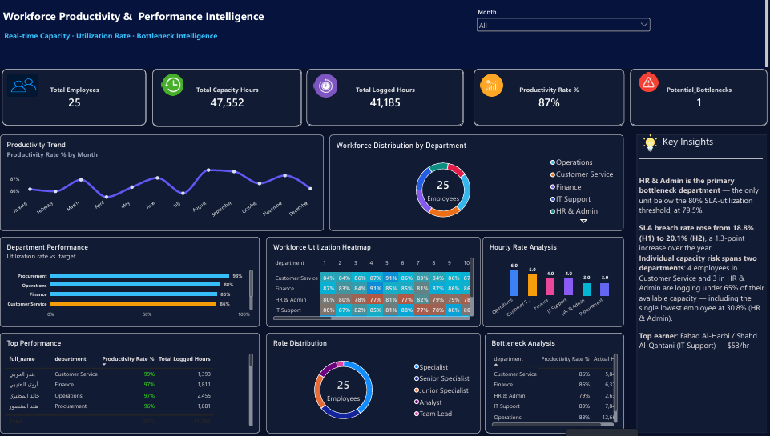

# Workforce Productivity & Bottleneck Intelligence Dashboard

## 📌 Executive Summary
This project delivers an executive-level workforce productivity and operational bottleneck intelligence dashboard built in Power BI. The objective is to bridge the gap between raw process logs and managerial decision-making by tracking employee utilization, SLA adherence, and department-level operational bottlenecks.

The dashboard analyzes **8,110 process log records** across **25 employees** in 6 departments over a 1-year period, totaling **41,185 logged hours** against **47,552 SLA-allowed hours** (86.6% aggregate SLA utilization, shown as 87% on the dashboard). The model flags bottlenecks through two complementary lenses: **HR & Admin** is the sole department below the 80% capacity-utilization threshold (79.3%), while **Procurement** is the task-level hotspot, breaching its SLA target on 27.8% of its individual tasks — nearly 3x the org-wide breach rate of 19.4%.

## 📸 Dashboard Preview


## 🎯 Business Problem & Objectives
- **Lack of Operational Visibility**: No consolidated view of how actual task duration compared to SLA targets across departments.
- **Unidentified Bottlenecks**: Departments and task types driving repeated SLA breaches went undetected in raw, unaggregated logs.
- **Manual Reporting Overhead**: Performance tracking previously required scattered spreadsheet exports rather than a centralized, refreshable model.

## 🛠️ Tech Stack & Architecture
- **Business Intelligence**: Microsoft Power BI
- **Data Transformation & ETL**: Power Query
- **Analytical Calculations**: DAX (Data Analysis Expressions)
- **Data Storage & Queries**: SQL / SQLite
- **Data Modeling**: Star-schema relational model — `Process_Logs` (fact) linked to `Employees` and `Tasks` (dimensions)

## 📐 Key Metrics & Business Logic

| Metric | Business Definition / Formula | Value |
|---|---|---|
| Total Employees | `DISTINCTCOUNT(Employees[employee_id])` | 25 |
| Total Process Logs | `COUNTROWS(Process_Logs)` | 8,110 |
| Total Capacity Hours | `SUMX(Process_Logs, RELATED(Tasks[sla_target_hours]))` | 47,552 |
| Total Logged Hours | `SUM(Process_Logs[actual_hours])`, where actual_hours = `DATEDIFF(start_time, end_time, MINUTE)/60` | 41,185 |
| Productivity Rate % | `DIVIDE([Total Logged Hours], [Total Capacity Hours])` | 87% |
| Potential Bottlenecks | Count of departments with Productivity Rate % below 80% | 1 (HR & Admin, 79.3%) |
| SLA Breach Rate | Share of individual logs where actual duration exceeds the task's SLA target hours | 19.4% |
| Task-Level Hotspot | Department with the highest SLA breach rate | Procurement (27.8%) |
| Avg Employee Utilization | Hours logged ÷ available weekly capacity over the period | 83% (range 31%–124%) |
| Est. Annual Cost of SLA Overruns | `SUMX(breached logs, overrun hours × Employees[hourly_rate])` | $29,400 |

## 📊 Dashboard Features & Visualizations
- **Executive KPI Header**: Total employees, total capacity hours, total logged hours, productivity rate %, and potential bottlenecks — with automatic conditional-formatting alerts.
- **Productivity Trend (Line Chart)**: Monthly productivity rate % to surface seasonal dips and spikes across the year.
- **Workforce Distribution by Department (Donut Chart)**: Headcount split across the 6 departments.
- **Department Performance (Bar Chart)**: Utilization rate vs. the 80% target per department, conditionally formatted to flag the department below threshold.
- **Workforce Utilization Heatmap**: Department × month matrix colored by breach rate — surfaces Procurement as a near-constant hotspot, peaking at 35% in September.
- **Hourly Rate Analysis**: Average hourly rate by department, identifying the highest-cost roles.
- **Top Performance (Table)**: Employees ranked by individual productivity rate and total logged hours.
- **Role Distribution (Donut) & Bottleneck Analysis (Table)**: Cross-checks utilization by role and department side by side, led on the overload side by Specialists (~101%) against Team Leads (~44%).

## 🧮 DAX Snippets Used

```dax
-- Duration per log (calculated column on Process_Logs)
Duration Hours = DATEDIFF(Process_Logs[start_time], Process_Logs[end_time], MINUTE) / 60

-- SLA Breach Rate
SLA Breach Rate % =
VAR BreachedLogs =
    FILTER(
        Process_Logs,
        Process_Logs[Duration Hours] > RELATED(Tasks[sla_target_hours])
    )
RETURN
    DIVIDE(COUNTROWS(BreachedLogs), COUNTROWS(Process_Logs))

-- SLA Utilization Rate
SLA Utilization Rate % =
DIVIDE(
    SUM(Process_Logs[Duration Hours]),
    SUMX(Process_Logs, RELATED(Tasks[sla_target_hours]))
)

-- Bottleneck Departments (breach rate above 25%)
Bottleneck Departments =
CALCULATE(
    DISTINCTCOUNT(Tasks[department]),
    FILTER(
        VALUES(Tasks[department]),
        [SLA Breach Rate %] > 0.25
    )
)
```

## 💡 Key Business Insights
- **HR & Admin is the primary bottleneck department** — the only unit below the 80% SLA-utilization threshold, at 79.3%.
- **SLA breach rate rose from 18.8% (H1) to 20.1% (H2)**, a 1.3-point increase over the year.
- **Individual capacity risk spans two departments**: 4 employees in Customer Service and 3 in HR & Admin are logging under 65% of their available capacity — including the single lowest employee at 30.8% (HR & Admin).
- **Aggregate vs. task-level risk**: the organization stays within its overall capacity budget (87% productivity rate), yet Procurement still breaches SLA on 27.8% of its individual tasks — proof that department-level averages alone can hide task-level hotspots.
- **Top earner**: Fahad Al-Harbi / Shahd Al-Qahtani (IT Support) — $53/hr.

## 🚀 How to Run / View
```bash
git clone https://github.com/YOUR_USERNAME/YOUR_REPO.git
```
Open `Workforce_Productivity_Dashboard.pbix` in Power BI Desktop. If refreshing from the underlying CSVs, re-point the Power Query data source paths to their local location.

---
*Note: `Employees.csv`, `Tasks.csv`, and `Process_Logs.csv` in this repository are a synthetically generated practice dataset built to simulate a realistic enterprise workforce scenario, not real company data.*

## 📄 CV / Portfolio Summary

> **Workforce Productivity & Bottleneck Intelligence** — *GitHub Repository* | Tools: SQL, Power BI, DAX, Power Query
> - Modeled 8,110 process logs across 25 employees into a star-schema Power BI dashboard, exposing a workforce capacity gap where department-level averages (87% productivity) masked task-level risk.
> - Built DAX measures identifying HR & Admin as the sole department below an 80% capacity-utilization threshold (79.3%) and Procurement as the top task-level SLA hotspot (27.8% breach rate, 3x the org average).
> - Quantified a rising SLA breach trend (18.8% → 20.1%, H1 to H2) and an estimated $29,400/year cost of SLA overruns, alongside a role-level workload imbalance (Specialists at ~101% utilization vs. Team Leads at ~44%).
